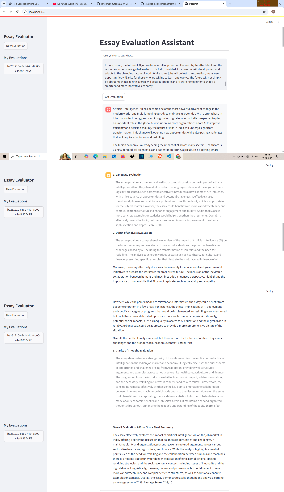

# Essay Evaluation Assistant 📝

This project is a web application that provides an automated, structured evaluation of essays, specifically designed to help with preparation for exams like the UPSC. It leverages the power of Large Language Models (LLMs) to analyze essays based on key criteria and provide detailed feedback and scores.

## ✨ Features

* **Multi-Criteria Evaluation:** The AI evaluates essays on three distinct criteria:
    * **Language Quality**
    * **Depth of Analysis**
    * **Clarity of Thought**
* **Structured Feedback:** Each evaluation includes specific feedback and a score out of 10 for each criterion.
* **Final Synthesis:** A comprehensive final report summarizes the essay's performance and provides an average score.
* **Session History:** Your previous evaluations are saved and accessible from the sidebar, allowing you to track your progress.
* **Expandable Textbox:** A user-friendly, expandable textbox for easy essay input.
* **Streaming:** Streaming of ai messages gives feel of an actual chatbot.
* 
## 💻 Technologies Used

* **LangChain / LangGraph:** The core engine for orchestrating the multi-step AI workflow. LangGraph's stateful, agentic framework allows for sequential, logical evaluations.
* **Streamlit:** The web framework used to build the interactive and user-friendly front-end application.
* **OpenAI GPT-4o-mini:** The Large Language Model that powers the evaluation process, generating the feedback and scores.
* **Pydantic:** Used to enforce a strict data schema for the AI's output, ensuring consistency and reliability.
* **Python:** The primary programming language for the entire project.

## 📸 App Screenshot

